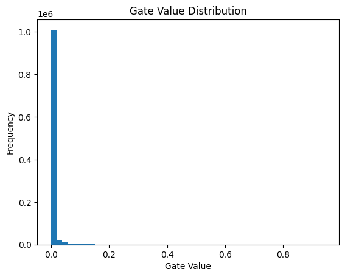
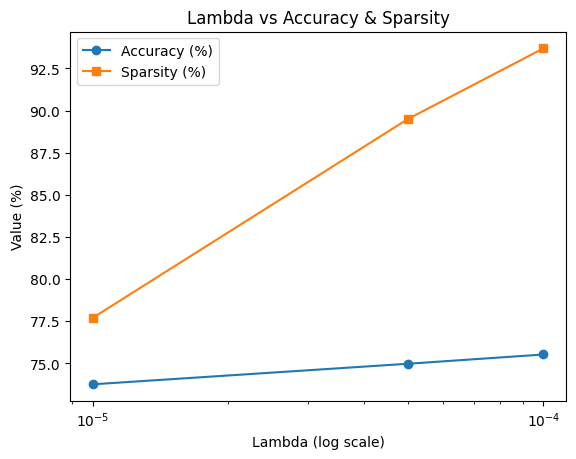
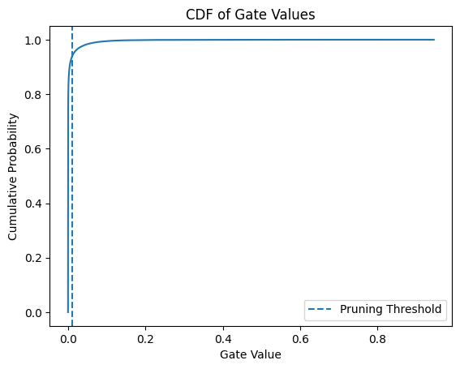

# Self-Pruning Neural Network on CIFAR-10

A PyTorch implementation of a neural network that learns to prune its own weights **during training** — no post-training pruning step required. Built as a case study submission for the Tredence AI Engineering Internship.

---

## Overview

Standard neural network pruning removes unimportant weights *after* training. This project takes a different approach: each weight is paired with a learnable **gate parameter** that is trained alongside the weights via an L1 sparsity penalty. Gates driven to zero effectively remove their corresponding weights, producing a sparse network on the fly.

The model is evaluated on **CIFAR-10** (10-class image classification). Results show that over **93% of FC-layer weights can be pruned** with only a marginal drop in accuracy (~1.8% relative to the unregularized baseline).

---

## Folder Structure

```
.
├── models/
│   ├── prunable_linear.py       # PrunableLinear layer implementation
│   └── network.py               # PrunableCNN model definition
├── utils/
│   ├── loss.py                  # Sparsity loss and total loss computation
│   └── metrics.py               # Sparsity level calculation utilities
├── data/                        # CIFAR-10 dataset (auto-downloaded)
├── config.py                    # Hyperparameters and training config
├── train.py                     # Training loop
├── evaluate.py                  # Evaluation and plot generation
├── requirements.txt
├── README.md
├── cdf img.png                  # CDF of gate values with pruning threshold
├── gate value distribution.png  # Histogram of gate values (best model)
└── lambda vs accuracy plot.png  # Lambda vs Accuracy & Sparsity tradeoff
```

---

## Architecture

- **Conv Block**: 2× (Conv2d → ReLU → MaxPool2d) — standard feature extractor, not pruned
- **FC Block**: 2× `PrunableLinear` layers (4096→256→10), with Dropout(0.3)

### `PrunableLinear`

A drop-in replacement for `nn.Linear` that adds a learnable `gate_scores` tensor of the same shape as `weight`. During the forward pass:

```python
gates        = torch.sigmoid(gate_scores)   # squash to (0, 1)
pruned_weight = weight * gates              # element-wise mask
output        = F.linear(x, pruned_weight, bias)
```

Gradients flow through both `weight` and `gate_scores` automatically via autograd.

---

## Loss Function

```
Total Loss = CrossEntropyLoss + λ × SparsityLoss
```

`SparsityLoss` = L1 norm of all gate values across all `PrunableLinear` layers (sum of all `sigmoid(gate_scores)`).

**Why L1 encourages sparsity:** The L1 penalty adds a constant gradient (-λ for each gate) pulling every gate toward zero. Unlike L2, which only shrinks values asymptotically, L1 can drive values to *exactly* zero because the subgradient at 0 is absorbed by the penalty, creating a stable zero fixed point. Gates corresponding to important weights resist this push because their task loss gradient outweighs the sparsity penalty; unimportant gates do not.

### Training Details

| Parameter | Value |
|---|---|
| Optimizer | Adam (lr=0.003) |
| Epochs | 30 |
| Batch size | 128 |
| Warm-up | No sparsity loss for first 5 epochs |
| Pruning threshold (eval) | 1e-2 |
| Data augmentation | RandomHorizontalFlip, RandomCrop(32, pad=4) |

The 5-epoch warm-up is critical — it lets the network learn meaningful representations before the sparsity pressure kicks in.

---

## Results

| λ (Lambda) | Test Accuracy | Sparsity Level |
|---|---|---|
| 1e-5 | 73.75% | 77.69% |
| 5e-5 | 74.97% | 89.49% |
| **1e-4** | **75.52%** | **93.69%** |

> **Best model: λ = 1e-4** — highest sparsity (93.69%) with the best accuracy (75.52%).

The counterintuitive accuracy increase at higher λ is likely due to the regularization effect: aggressive gate pruning acts as implicit regularization, similar to Dropout, reducing overfitting.

---

## Plots

### 1. Gate Value Distribution (`gate_value_distribution.png`)



A histogram of all gate values from the best model (λ = 1e-4). The massive spike at ~0 (≈1M weights) confirms the network has successfully learned to prune itself — the vast majority of gates collapsed to near-zero. A small cluster of non-zero gates represents the connections the model deemed essential for classification.

---

### 2. Lambda vs Accuracy & Sparsity (`lambda_vs_accuracy_plot.png`)



Tracks both test accuracy and sparsity as λ increases (log scale). Key observations:
- **Sparsity scales aggressively** with λ — going from 77.7% at 1e-5 to 93.7% at 1e-4.
- **Accuracy is remarkably stable**, dropping less than 2% across the entire range.
- The orange (sparsity) curve rises much faster than the blue (accuracy) curve falls, showing a highly favorable pruning tradeoff.

---

### 3. CDF of Gate Values (`cdf_img.png`)



The Cumulative Distribution Function of gate values for the best model. The CDF reaches ~0.94 by the pruning threshold (dashed line at ~0.01), confirming that over 93% of gates lie below the threshold. The steep vertical rise near 0 visually reinforces the bimodal nature of the gate distribution — gates are either essentially zero or meaningfully active, with very little in between.

---

## Key Insights

**1. Gated weights learn a clean binary structure.**
Despite the gates being continuous values (0–1), training with L1 pressure pushes them toward a near-binary distribution: most gates converge to ~0 and a minority to larger positive values. This "soft" mechanism produces hard-pruning-like behavior without requiring any discrete decisions.

**2. Higher λ doesn't necessarily hurt accuracy.**
Conventional wisdom suggests more pruning → more accuracy loss. Here, λ = 1e-4 achieved *better* accuracy than λ = 1e-5 while pruning 16% more weights. The L1 penalty acts as a strong regularizer, which helps on a relatively small dataset like CIFAR-10.

**3. Warm-up epochs are essential.**
Applying sparsity loss from epoch 1 destabilizes training (the network tries to prune before it has learned anything useful). A 5-epoch warm-up resolves this, allowing the loss to spike early (visible in training logs) and then recover as the network learns which connections matter.

**4. Pruning only the FC layers is efficient.**
The conv layers handle feature extraction and are kept dense. The FC layers — which contain the bulk of parameters (4096×256 + 256×10 ≈ 1M weights) — are where the pruning happens, giving large compression gains with minimal architectural complexity.

**5. L1 vs L2 for sparsity.**
L2 regularization would shrink gate values but never reach exactly zero. L1 is the right choice here because its uniform gradient magnitude makes zero a stable attractor, producing genuine sparsity rather than just small weights.

---

## Requirements

```
torch
torchvision
matplotlib
numpy
```

Run on Google Colab with a T4 GPU (recommended) or any CUDA-enabled machine.
